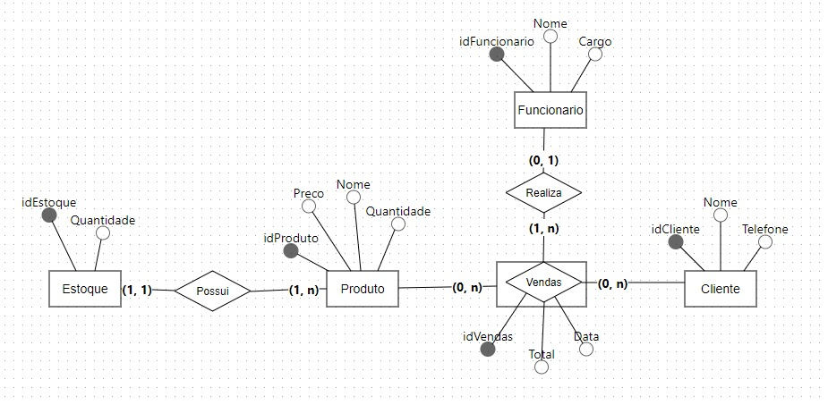
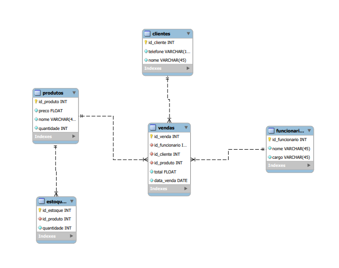

<h1 align="center">Sistema de gerenciamento de loja física</h1>
<p align="center">


</p>

## 🛍 Visão Geral

Bem-vindo ao *Sistema de Controle de Vendas em Loja Física*!  
Este projeto foi desenvolvido para otimizar a gestão de uma loja física, com foco em *controle de estoque, **vendas**, **produtos**, **clientes**, **funcionários** e **estoque de produtos**.O objetivo principal deste projeto é aplicar na prática conceitos de banco de dados e Programação Orientada a Objetos (POO) utilizando a linguagem Java. O sistema implementa operações essenciais de CRUD (Criar, Ler, Atualizar e Deletar) em um banco de dados relacional, permitindo uma compreensão aprofundada tanto dos aspectos lógicos e físicos do banco de dados quanto dos princípios fundamentais de POO.

## 🚀 Funcionalidades

### 🧾 Gestão de Produtos
- Cadastrar, listar, atualizar e remover produtos: Gerencie produtos com atualização de preços e controle de quantidades vendidas.
  
### 📦 Gestão de Estoque
- Cadastrar, listar, atualizar e remover itens do estoque: Gerencie produtos no estoque com detalhes como quantidade e informações de produto.

### 🛒 Gestão de Vendas
- Cadastrar, listar, atualizar e remover vendas: Registre e controle vendas com informações de cliente, funcionário, produto e valor total.


### 👥 Gestão de Clientes
- Cadastro e histórico de compras:  Mantenha um registro completo dos clientes com a possibilidade de realizar operações de cadastro, atualização e remoção.

### 👨‍💼 Gestão de Funcionários
- Cadastro e controle de funcionários:  Registre e gerencie os funcionários responsáveis pelas vendas.

## 🛠 Tecnologias Utilizadas
- *Java*: Backend e operações de integração com o banco de dados.
- *MySQL*: Banco de dados relacional para armazenamento dos dados.
- *JDBC*: API para conexão e manipulação do banco de dados MySQL.


## 📊 Modelos de Banco de Dados
### Modelo Conceitual


### Modelo Lógico



## 💻 Como Executar o Projeto
1. Clone este repositório
   
 ```
bash
   git clone https://github.com/debCristina/literalura.git
```
2. Importe execute o script SQL localizado na pasta /database para estruturar as tabelas e dados iniciais.
   
3.  No arquivo `src/util/ConexaoUtil` configure com suas informações

   ```
    private String caminho = "localhost";
    private String porta = "3306";
    private String nomeBancoDeDados = "bd_lojafisica";
    private String usuario = "root";
    private String senha = System.getenv("DB_MYSQL_PASSWORD");

   ```
   
- Configure o **caminho**, **porta de execução**, **nome do banco de dados**, **usuario* e a **variável de ambiente ${DB_MYSQL_PASSWORD}** peloa valores específicos do seu ambiente de desenvolvimento.
- Abra o projeto em sua IDE java preferida.
- Execute a aplicação e aproveite as funcionalidades disponíveis.


## 📅 Etapas do Projeto

1. *Modelagem do Banco de Dados*: Criação dos modelos conceitual, lógico e físico.
2. *Desenvolvimento da Aplicação*: Implementação das operações CRUD.
3. *Entrega*: Publicação do projeto no GitHub com código-fonte e documentação completa.

---

Desenvolvido por 
- Débora Cristina Silva Ferreira
- Filipe Silva da Fonseca
- Samantha Yumi Tanaka
- Vinicios Trindade Costa
- Wictor Emanoel Ponte Menezes

